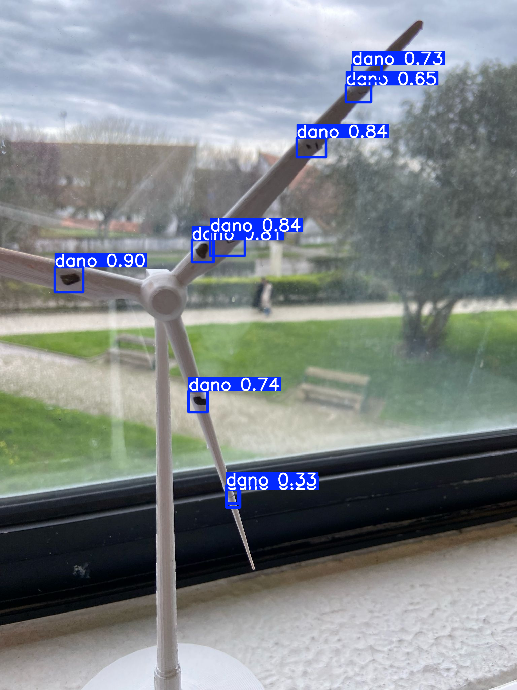

# Wind Turbine Blade Damage Detection using Computer Vision

## Project Overview
This project leverages **Deep Learning** and **Computer Vision** techniques to automatically identify and localize damage (such as cracks, erosion, and other defects) on wind turbine blades from image data. The primary goal is to develop a tool that aids in **predictive maintenance**, making inspections safer, faster, and more cost-effective.

This repository contains all the source code, trained models, and documentation developed as part of a portfolio project for a **Master's degree application**.

---

## 📜 Table of Contents
- [Background and Motivation](#-background-and-motivation)
- [Dataset Creation and Preprocessing](#-dataset-creation-and-preprocessing)
- [Tech Stack](#️-tech-stack)
- [Repository Structure](#-repository-structure)
- [How to Use](#-how-to-use)
- [Results](#-results)
- [Limitations and Future Work](#-limitations-and-future-work)
- [License](#-license)
---

## 🎯 Background and Motivation
The maintenance of wind turbines is a critical and expensive operation. Manual inspections are time-consuming, pose significant risks to technicians, and can lead to extended periods of turbine downtime. Automating this process with **Artificial Intelligence** can drastically reduce costs and hazards while enabling the early detection of faults, thereby preventing catastrophic failures and optimizing energy production.

---

## 🖼️ Dataset Creation and Preprocessing
The dataset was created innovatively for this project.
1.  **Damage Creation:** Small wind turbines were used as a model. Damage such as cracks and chips was simulated using **stickers** applied directly to the blades.
2.  **Image Capture:** Photographs of the mini-turbines were taken.
3.  **Annotation and Preprocessing:** The **Roboflow** platform was used to annotate the damage on each image and perform preprocessing. **Data augmentation techniques**, such as **saturation, brightness, and rotation**, were applied to diversify the dataset and improve the model's robustness.

---

## 🛠️ Tech Stack
- **Language:** Python 3.11
- **Core Framework:** YOLOv8 (Ultralytics)
- **Data Preprocessing:** Roboflow (for annotation and data augmentation)
- **Subjacent Libraries:** OpenCV, Pandas, NumPy (used internally by YOLOv8 for data handling and analysis)
- **Development Environment:** Jupyter Notebooks, Visual Studio Code

---

## 📁 Repository Structure
```
├── dataset/                <- Contains all data for training and validation
│   ├── data.yaml           <- The main YOLOv8 dataset configuration file
│   ├── train/              <- Training data (images and labels)
│   └── valid/              <- Validation data (images and labels)
│
├── runs/                   <- Default output directory for all YOLOv8 experiments
│   ├── detect/
│   │   ├── train/          <- Results from training runs (weights, plots, logs)
│   │   └── predict/        <- Images and videos saved from inference runs
│
├── weights/                <- Stores the final, best-performing model weights
│   └── best.pt             <- The model checkpoint to be used for inference
│
├── notebooks/              <- For experimentation and detailed analysis
│   └── YOLOv8_Training.ipynb <- Jupyter Notebook showing the training process step-by-step
│
├── .gitignore              <- Specifies intentionally untracked files to ignore (e.g., venv)
├── LICENSE                 <- Project license file (MIT License)
├── README.md               <- This file: the main project documentation
├── requirements.txt        <- A list of all Python libraries required to run the project
├── predict.py              <- Script to run inference on a static image or video file
└── live_predict.py         <- Script to run real-time detection using a connected camera
```

---

## ⚙️ How to Use
1.  **Clone the repository:**
    ```bash
    git clone [https://github.com/BrunoMarquesDS/wind-turbine-blade-damage-detection.git](https://github.com/BrunoMarquesDS/wind-turbine-blade-damage-detection.git)
    cd wind-turbine-blade-damage-detection
    ```
2.  **Install dependencies:**
    ```bash
    pip install -r requirements.txt
    ```
3.  **Run the training:**
    Open the `YOLOv8_Training.ipynb` in Jupyter Notebook or Visual Studio Code and run the cells to train the model.
4.  **Run inference:**
    To run detections on new images, use the `predict.py` or `live_predict.py` script.
    ```bash
    python predict.py --source "path/to/your/image.jpg" --weights "path/to/your/best.pt"
    ```

---
## 📊 Results
This section showcases the model's performance and output.

**Sample Detection:**

*Example of a crack detected on a turbine blade by the model.*

**Performance Metrics:**
| Metric     | Value |
|------------|-------|
| Accuracy   | 0.866 |
| Precision  | 0.916 |
| Recall     | 0.931 |
| F1-Score   | 0.923 |

---

## 🚧 Limitations and Future Work

**Current Limitations:**
- The model was trained on a dataset of limited size, which may affect its generalization to unseen data.
- Performance can be sensitive to variations in lighting conditions, image quality, and camera angles.

**Future Work:**
- **Data Augmentation:** Expand the dataset with more diverse examples of damage types and environmental conditions.
- **Model Architecture:** Experiment with more advanced architectures (e.g., YOLOv8, Mask R-CNN) to potentially improve accuracy and localization.
- **Optimization:** Optimize the model for deployment on edge devices for real-time analysis during drone inspections.

---

## 📄 License
This project is licensed under the **MIT License**. See the LICENSE file for more details.